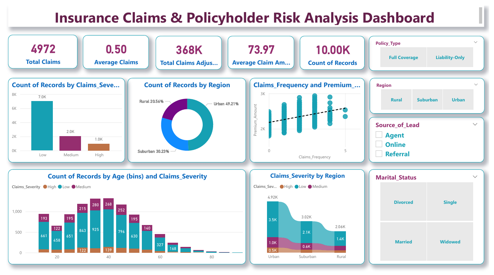

# Insurance Claims & Policyholder Risk Analysis Dashboard

## 📊 Dashboard Preview

*Snapshot of the dashboard highlighting key risk metrics, claim severity distribution, and demographic insights.*

## 📌 Project Overview
This repository hosts a comprehensive **Power BI Dashboard** designed to analyze insurance claims, assess policyholder risk profiles, and evaluate premium pricing strategies. Using a robust synthetic dataset of **10,000 policyholders**, this project provides actionable insights into risk segmentation, demographic trends, and the financial impact of claims.

## 📂 Files Included
* **`Insurance Claims & Policyholder Risk Analysis Dashboard.pbix`**: The interactive Power BI report file containing all visualizations and data models.
* **`synthetic_insurance_data.csv`**: The underlying dataset used for the analysis.
* **`Insurance Claims & Policyholder Risk Analysis Dashboard.pdf`**: A static PDF export of the report for quick viewing.

## 💡 Key Insights & Metrics
The analysis highlights several critical trends in the policyholder base:

* **High-Level Metrics**:
    * **Total Claims**: 4,972
    * **Total Claims Adjustment Cost**: $368K
    * **Average Claims Frequency**: 0.50
    * **Average Claim Amount**: $73.97

* **Risk & Demographics**:
    * **Geographic Split**: The majority of policyholders reside in **Urban** areas (49.21%), followed by **Suburban** (30.23%) and **Rural** (20.56%) regions.
    * **Claims Severity**: The dataset shows a favorable risk profile, with the vast majority of claims categorized as **"Low" severity** (7.0K records), significantly outweighing "Medium" (2.0K) and "High" (1.0K) severity claims.
    * **Policy Types**: The analysis covers both **Full Coverage** and **Liability-Only** policy types.

## 🗂️ Dataset Description
The dashboard is built on the `synthetic_insurance_data.csv` file, which contains **10,000 records** with the following key attributes:

| Category | Columns |
| :--- | :--- |
| **Demographics** | `Age`, `Marital_Status` (Married, Single, Divorced, Widowed), `Is_Senior`, `Region` |
| **Policy Info** | `Policy_Type`, `Premium_Amount`, `Source_of_Lead` (Agent, Online, Referral) |
| **Risk Metrics** | `Claims_Frequency`, `Claims_Severity`, `Credit_Score`, `Safe_Driver_Discount` |
| **Conversion** | `Conversion_Status`, `Time_to_Conversion`, `Inquiries` |

## ⚙️ How to Use
1.  **Clone the Repository**:
    ```bash
    git clone [https://github.com/SarthakMeher19/Insurance-Claims-Risk-Analysis.git](https://github.com/SarthakMeher19/Insurance-Claims-Risk-Analysis.git)
    ```
2.  **Open the Dashboard**:
    * Download and install **Microsoft Power BI Desktop**.
    * Open `Insurance Claims & Policyholder Risk Analysis Dashboard.pbix`.
3.  **Interact**:
    * Use filters for **Marital Status** or **Region** to dynamically update the visuals.
    * Analyze the scatter plot to see the correlation between *Claims Frequency* and *Premium Amount*.

## 🛠️ Tools Used
* **Microsoft Power BI**: Dashboard creation, DAX measures, and data modeling.
* **Python/Excel**: Initial data generation and preprocessing.

---
*Created by Sarthak Meher*
